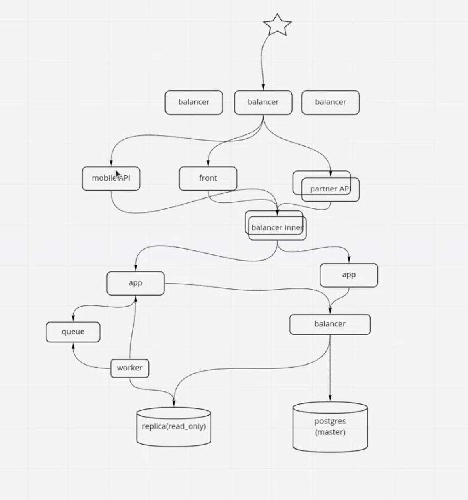

1. Мы можем добавить несколько реплик БД. Реплики работают только на чтение, но новые страны появляются редко, поэтому производительность на запись нам не важна. Из минусов потребуется больше машин для серверов реплик.
   
   Так же можно кешировать запросы на уровне API. Скорее всего в интерфейсе это будет список стран доступных для пользователя или региона. Эти запросы мы кешируем и храним ответ от БД в redis. Таким образом мы может отвечать пользователю на типовой запрос без хождения в БД. Redis хранит данные в памяти, поэтому из минусов возможно увеличение потребляемой памяти.
   
2. Если мы упираемся в ограничения по чтению/записи, то можно включить сжатие в бд. Минус в том что потребуется больше процессорных мощностей.
   
   Второй вариант это разбить таблицу на секции. Например ваканскии за 2019, 2020 и 2021 года. И обращаться к нужной секции. Из минусов более сложный код работы с бд.
   
3. Узкое место приложение app - если нам потребуется его масштабировать, то ресурсы будут распределены не оптимально. Как решение разбить наше приложение на сервисы/микросервисы, что даст нам возможность увеличивать производительность в тех местах где высокая нагрузка и в случае отказа одного из сервисов система в целом будет работать.
   
   Минусы такого решения - увеличение накладных расходов, в первую очередь сетевого взаимодействия между сервисами и возможность конфликтов когда разные сервисы будут записывать данные в бд.

   
